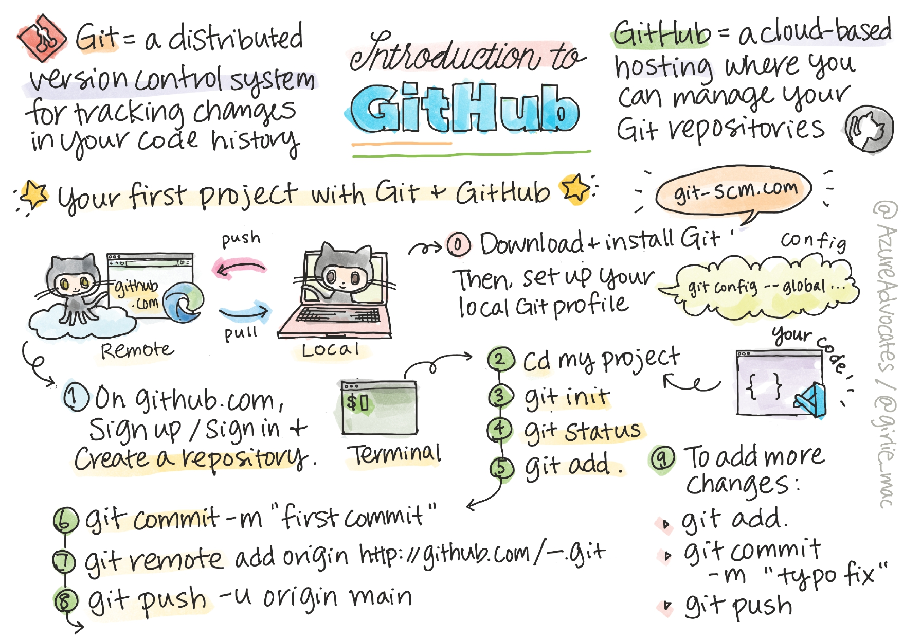

# Git-and-Github

In these classes, you'll be learning -
1. how to use git offline and how to use Github.
2. how to use readme.md and licenses
3. how to collaborate on projects and contribute to open-source projects
4. how to host websites using github pages
5. how to use github desktop application
6. how to use github with other services like replit

## Introduction to GitHub

## Okay, But Why? 
Git is a version control system. Its original purpose was to help groups of developers work collaboratively on big software projects. Git manages the evolution of a set of files – called a repository – in a sane, highly structured way. If you have no idea what I’m talking about, think of it as the “Track Changes” features from Microsoft Word on steroids.

##### Programmers collaborating on large projects without git and GitHub be like - 

### Points To Remember - 

#### Repository (repo) -
The directory, located at the top level of a working tree, where Git keeps all the history and metadata for a project.

#### Branch -
A branch is a version of the repository that diverges from the main working project. It is an essential feature available in most modern version control systems. A Git project can have more than one branch. We can perform many operations on Git branch-like rename, list, delete, etc.

#### Push -
The push term refers to upload local repository content to a remote repository. Pushing is an act of transfer commits from your local repository to a remote repository. Pushing is capable of overwriting changes; caution should be taken when pushing.

#### Pull/Pull Request -
The term Pull is used to receive data from GitHub. It fetches and merges changes on the remote server to your working directory. The git pull command is used to make a Git pull.

<b> Pull requests </b> are a process for a developer to notify team members that they have completed a feature. Once their feature branch is ready, the developer files a pull request via their remote server account. Pull request announces all the team members that they need to review the code and merge it into the master branch.

#### Fork
A fork is a rough copy of a repository. Forking a repository allows you to freely test and debug with changes without affecting the original project.

Great use of using forks to propose changes for bug fixes. To resolve an issue for a bug that you found, you can:

1. Fork the repository.
2. Make the fix.
3. Forward a pull request to the project owner.

## Git vs GitHub
As you work with Git and GitHub, you may wonder about the difference between the two.

Git is a distributed version control system (DVCS) that allows multiple developers or other contributors to work on a project. It provides a way to work with one or more local branches and push them to a remote repository. Git is responsible for everything GitHub-related that happens locally on your computer. Key features provided by Git include -

- It's installed and used on your local machine
- Handles version control
- Supports branching
- To learn more about Git, see [Using common Git commands.](https://docs.github.com/en/free-pro-team@latest/github/using-git/using-common-git-commands)

GitHub is a cloud platform that uses Git as its core technology. It simplifies the process of collaborating on projects and provides a website, command-line tools, and overall flow that allows developers and users to work together. GitHub acts as the "remote repository" mentioned previously in the Git section.

Key features provided by GitHub include -

- Issues
- Discussions
- Pull requests
- Notifications
- Labels
- Actions
- Forks
- Projects
- To learn more about GitHub, see [Getting started with GitHub.](https://docs.github.com/en/free-pro-team@latest/github/getting-started-with-github)

## Additional Resources -
- [Getting started with your GitHub Account](https://docs.github.com/en/get-started/onboarding/getting-started-with-your-github-account)
- [Learn more about contributing to open source projects.](https://opensource.guide/how-to-contribute/#how-to-submit-a-contribution)
- [Git Cheatsheat](https://training.github.com/downloads/github-git-cheat-sheet/)
- [Practice is the key, practice you GitHub skils here](https://lab.github.com/)

## And finally, use git and GitHub regularly while working on your projects and assigments to make your workflow much convenient

